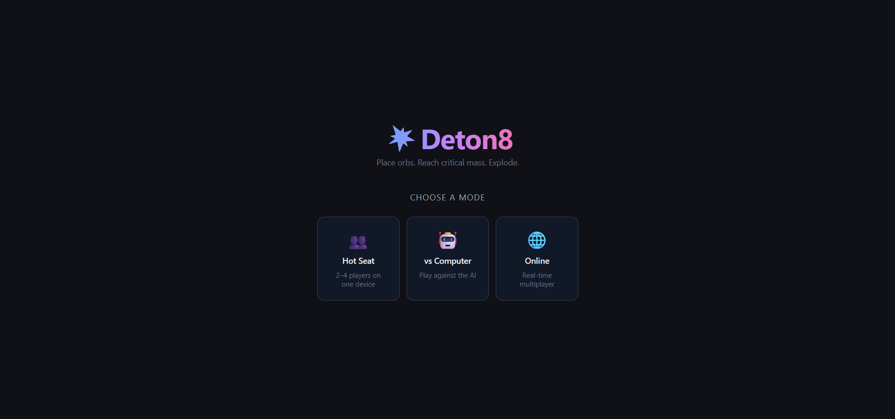
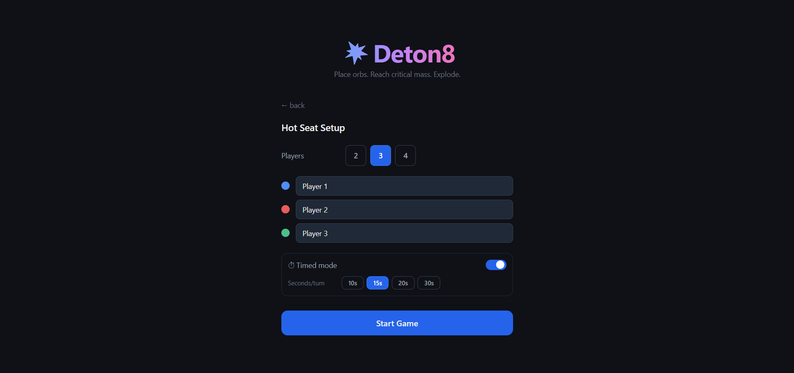
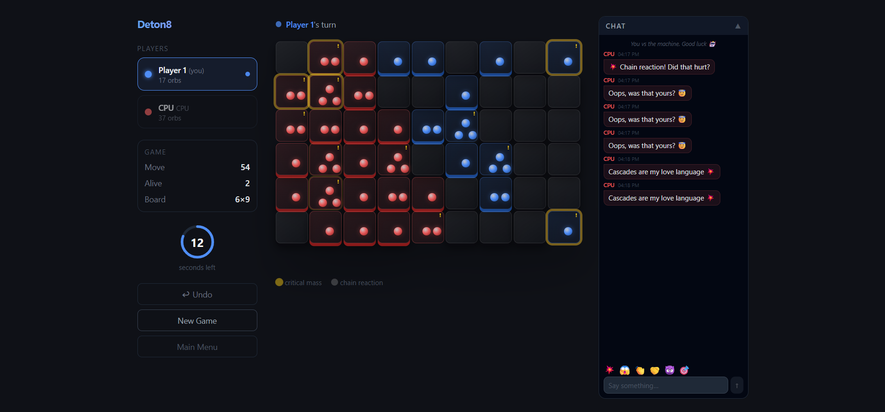
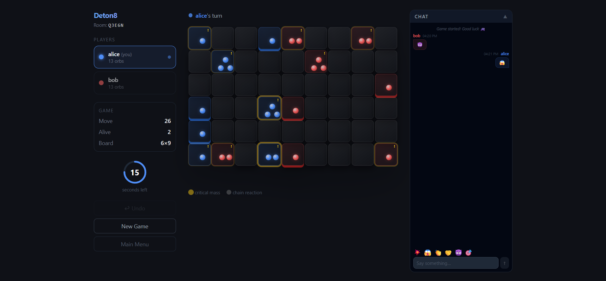

<div align="center">

# 💥 Deton8
[🎮 Play Live Demo](https://deton8.vercel.app)


**The classic Chain Reaction board game — reimagined for the web.**

A full-stack multiplayer board game built with Next.js, Node.js, and Socket.io. Designed for real-time online play, AI opponents, timed turns, and a fully immersive 3D board experience — all running in the browser with zero plugins.

[](https://nextjs.org)
[](https://nodejs.org)
[](https://socket.io)
[](https://typescriptlang.org)
[](https://tailwindcss.com)

*Place orbs. Reach critical mass. Explode.*

</div>

---

## Table of Contents

- [Overview](#overview)
- [Screenshots](#screenshots)
- [Features](#features)
- [Game Rules](#game-rules)
- [Tech Stack](#tech-stack)
- [Architecture](#architecture)
- [AI Implementation](#ai-implementation)
- [Key Design Decisions](#key-design-decisions)
- [Docker](#docker)
- [Getting Started](#getting-started)
- [Environment Variables](#environment-variables)
- [Deployment](#deployment)
- [Contributing](#contributing)

---

## Overview

Deton8 is a full-stack implementation of the chain reaction board game. Players take turns placing orbs on a grid; when a cell hits its critical mass it explodes, sending orbs to neighbours and potentially triggering a cascade. The last player with orbs on the board wins.

Three modes are supported out of the box: **Hot Seat** (2–4 players, one screen), **vs Computer** (easy / medium AI), and **Online Multiplayer** (real-time via WebSockets and 5-letter room codes). All three modes support optional timed turns with per-player countdowns.

---

## Screenshots

| Home | Hot Seat |
|------|----------|
|  |  |

| vs Computer | Multiplayer |
|-------------|-------------|
|  |  |

---

## Features

### Three game modes

**Hot Seat** — 2–4 players take turns on the same screen. No account or server required.

**vs Computer** — Play against an Easy (random valid move) or Medium (greedy heuristic AI) opponent. The AI runs fully in the browser with no network calls.

**Online Multiplayer** — Create a room, share the 5-letter code, and play in real-time over WebSockets. The backend is the authoritative source of truth for all game state. Supports 2–4 players per room.

### Timed mode

An optional per-turn countdown (10 / 15 / 20 / 30 seconds) available in all three game modes. A live SVG ring indicator ticks down with the current player's colour. When time expires, the turn is automatically skipped. In online mode the skip is backend-authoritative — only the active player's client emits the skip event, and all clients wait for the broadcast to reset their timers. Undo does not reset the countdown.

### Disconnect handling

If a player closes their tab or loses connection during an online game, the remaining player is immediately declared the winner. A system message appears in the chat panel naming who left.

### Single undo

Roll back your last move once per turn. The undo button is disabled after use and re-enables on the next turn. Does not reset the turn timer.

### In-game chat

A collapsible chat panel with quick emoji reactions, unread message badge, auto-scroll, and message alignment matching standard chat conventions (own messages right-aligned, others left-aligned). System events (game start, player left, time up) appear as centred italicised notices.

### Sound effects

Procedural Web Audio synthesis — no audio files. Four events: orb placement (short click), chain explosion (low boom), urgent tick (last 3 seconds), and win fanfare. All sounds are generated at runtime via the oscillator and gain APIs.

### 3D board

CSS `perspective` and per-cell `box-shadow` depth walls create a 3D tray effect. Orbs use a radial gradient with a bright top-left highlight and dark bottom-right shadow to simulate a sphere. Critical-mass cells pulse with a warning glow; exploding cells animate outward.

---

## Game Rules

1. Players take turns placing one orb in any **empty cell** or a **cell they already own**.
2. Each cell has a **critical mass** equal to its number of adjacent cells:
    - Corner cell → 2 &nbsp;|&nbsp; Edge cell → 3 &nbsp;|&nbsp; Interior cell → 4
3. When a cell reaches critical mass it **explodes** — all its orbs spread to each neighbour, converting them to the current player's colour.
4. Explosions cascade until no cell is overloaded (chain reactions).
5. A player is **eliminated** once they have no orbs left on the board (immunity applies until every player has placed their first orb).
6. Last player standing **wins**.

---

## Tech Stack

| Layer | Technology |
|---|---|
| Frontend framework | Next.js 14 (App Router) |
| Styling | Tailwind CSS + inline CSS custom properties |
| Real-time comms | Socket.io client `4.6.2` |
| Backend | Node.js + Express + Socket.io server |
| Language | TypeScript (strict) throughout |
| Sound | Web Audio API — procedural synthesis, zero dependencies |
| 3D board | CSS `perspective` + `box-shadow` depth walls |
| Orb rendering | Radial-gradient sphere illusion |
| AI | One-ply greedy with fast positional pre-filter |
| Containerisation | Docker + Docker Compose |
| CI/CD | GitHub Actions → Docker Hub |

---

## Architecture

### Hot Seat / vs Computer — Local Path

```
React Frontend (Next.js)
      │
      │  sessionStorage passes GameConfig from setup → game page
      ▼
useGame hook
      │
      ├─ gameEngine.ts  (pure functions — applyMove, criticalMass, skipTurn)
      │        │
      │        └─ chain reactions resolved synchronously, state immutable
      │
      ├─ aiPlayer.ts    (vs Computer mode only)
      │        │
      │        └─ two-stage greedy: heuristic pre-filter → simulate top N
      │
      └─ soundEngine.ts (Web Audio API — no dependencies)

No backend involved. Runs entirely in the browser.
```

### Online Multiplayer — Network Path

```
Player A (Browser)                    Player B (Browser)
      │                                      │
      │  emit("makeMove", { r, c })          │
      ▼                                      ▼
      └──────────────┐          ┌────────────┘
                     │          │
              Socket.io (WebSocket / polling)
                     │
                     ▼
            Node.js + Express Backend
                     │
              roomManager.ts
                     │
                     ├─ validate: correct player, valid cell
                     ├─ gameEngine.ts  ← source of truth
                     │        │
                     │        └─ applyMove → resolves chain reactions
                     │
                     └─ broadcast("gameStateUpdate") → all players in room
```

### Timed Mode — Turn Skip Path

```
Client-side countdown (useGame hook)
      │
      │  timeLeft reaches 0
      ▼
      ├─ [online]  emit("skipTurn")  → backend validates + skips + broadcasts
      └─ [local]   skipTurn(gameState) called directly in hook
```

Only the client whose turn it is emits `skipTurn` in online mode. All clients wait for the authoritative `gameStateUpdate` broadcast to reset their timers — preventing desync.

### Disconnect Handling

```
Player disconnects (socket "disconnect" event)
      │
      ▼
roomManager.removePlayer()
      │
      ├─ game was in progress AND only 1 player remains?
      │        │ YES
      │        └─ set status = "finished", winner = remaining player
      │
      └─ broadcast:
           ├─ "playerLeft"      → show system message in chat
           ├─ "gameStateUpdate" → sync sidebar
           └─ "gameOver"        → trigger win screen (if winner set)
```

### Game Engine Design

`gameEngine.ts` is **pure functions with no side effects** and is duplicated in both `frontend/src/lib/` and `backend/src/`. Local modes run it entirely in the browser; the backend runs it as the authoritative source in online mode. Both sides always execute identical logic.

---

## AI Implementation

Pure combinatorial search — no external AI services or LLMs.

**Easy** — picks a uniformly random valid move.

**Medium** — one-ply greedy with a two-stage approach:

1. Score every valid move with a fast positional heuristic. Prefers cells already near critical mass (maximises chain potential) and penalises moves that hand the opponent an immediate chain trigger.
2. Take the top 6 candidates by heuristic score.
3. Simulate each candidate with the full `applyMove` engine and score the resulting board state: own orb count − opponent orb count + weighted bonus for owning cells at critical mass − 1.
4. Pick the move with the best simulated outcome.

The two-stage approach keeps AI response time under ~5 ms even on dense boards with 40+ valid moves, by avoiding a full simulation pass over every candidate.

---

## Key Design Decisions

**Pure game engine shared between client and server** — `gameEngine.ts` is a file of pure functions with no imports, no side effects, and no framework dependencies. It is copied verbatim into both packages. Local modes run it in the browser; online mode runs it on the server as the source of truth. This eliminates client/server logic divergence entirely.

**`sessionStorage` for config passing** — the setup page writes `GameConfig` to `sessionStorage` and the game page reads it on mount. This avoids URL query parameters (which would expose config in the address bar and complicate sharing) and avoids a global state store (which adds complexity for a single hand-off).

**Backend-authoritative turn skipping in timed mode** — only the client whose turn it is emits `skipTurn`. The backend validates, advances the state, and broadcasts to all clients. This prevents desync: two clients cannot independently decide to skip the same turn, and a slow client cannot skip someone else's turn early.

**Undo without timer reset** — undo reverts the game state but does not restart the countdown. The timer continues from wherever it was, keeping competitive play fair.

**Disconnect-to-win** — when a player disconnects mid-game, the backend immediately sets `status: "finished"` and assigns the winner before broadcasting. Clients receive a `gameStateUpdate` followed by `gameOver`, so the win screen appears without any client-side polling or timeout.

**Procedural sound via Web Audio API** — avoids shipping audio files (which add bundle size and require CDN hosting). All sounds are synthesised at runtime using oscillators and gain envelopes. The engine lazily creates an `AudioContext` on first interaction to comply with browser autoplay policies.

---

## Docker

### Start the stack

```bash
git clone https://github.com/trimoyeeg/deton8.git
cd deton8/chain-reaction
docker compose up -d --build
```

Open [http://localhost:3000](http://localhost:3000) — done.

### Pull latest images

```bash
docker compose pull
docker compose up -d
```

### Stop the stack

```bash
docker compose down
```

Images are built and published to Docker Hub automatically on every push to `main` via GitHub Actions.

---

## Getting Started

### Prerequisites

- Node.js 20+

### Backend

```bash
cd chain-reaction/backend
npm install
npm run dev        # http://localhost:4000
```

For production:

```bash
npm run build
npm start
```

### Frontend

```bash
cd chain-reaction/frontend
npm install
npm run dev        # http://localhost:3000
```

Open [http://localhost:3000](http://localhost:3000) in your browser.

> For **Hot Seat** and **vs Computer** you only need the frontend running.
> For **Online** mode you need both running.

---

## Environment Variables

| Variable | Default | Description |
|---|---|---|
| `NEXT_PUBLIC_BACKEND_URL` | `http://localhost:4000` | Backend WebSocket URL, baked into the frontend bundle at build time |
| `PORT` | `4000` | Backend listening port |

---

## Deployment

The frontend is deployed on Vercel and the backend on Railway.
GitHub Actions automatically builds and publishes Docker images to Docker Hub on every push to `main`.
> Hot Seat and vs Computer work on the Vercel frontend alone — no backend needed.

---

## Contributing

1. Fork the repo
2. Create a feature branch (`git checkout -b feature/your-feature`)
3. Commit your changes
4. Push and open a pull request

---

<div align="center">
Built to explode.
</div>
